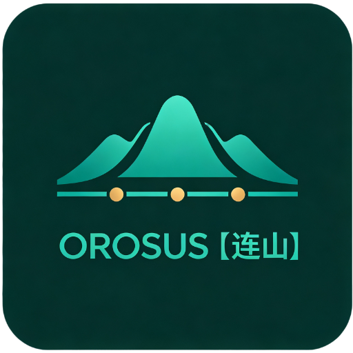

<p align="center">
  
</p>

<p align="center">
  <b>简体中文</b> · <a href="README_EN.md">English</a> · <a href="docs/ROADMAP.md">路线图</a> · <a href="docs/developers.md">开发者指南</a>
</p>

<p align="center">
  
  
  
  <a href="LICENSE"></a>
</p>

<p align="center">
  玄墨铺底以为架，青玉点窍以为神，石青叠层峦之形，暖金走灵犀之脉，赭石定磐礡之根。<br>
  群峰连亘而不绝，百脉周流而相通。
</p>

<p align="center">
  <b>Orosus</b> 是一个模块化 AI 编程助手 CLI——TypeScript 编写、Node 22+ 直接运行（无需编译），<br>
  由核心内核、契约包和一组可插拔模块组成，内置模块与外部模块走同一条注册管线。
</p>

<p align="center">
  
</p>

## 为什么叫 Orosus

中文定名「**连山**」——本义连绵群山，一峰接一峰，象义**模块互连、组件层叠、首尾接续**。
**Orosus** 取自希腊语 *oros*（ὄρος，山）衍生构词：词根 `oros` 即山，呼应中文定名。
发音：/ɒˈrəʊsəs/（英读）/oʊˈroʊsəs/（美式）。

---

## 三分钟上手

### 1. 安装

**方式一：npm 安装（推荐）**——需 [Node.js ≥ 22](https://nodejs.org/)：

```bash
npm i -g orosus
```

**方式二：源码安装**——适合参与开发：

```bash
git clone https://github.com/zhangxyfs/Orosus.git
cd Orosus
pnpm install
```

### 2. 启动

npm 安装敲 `orosus`（源码安装敲 `pnpm orosus`）。

升级敲 `orosus upgrade`——确认后下载校验、自动全局安装；平时每次启动也会自动检查新版本，有更新横幅常驻提示（`/settings → 更新检查` 可关自动口）。

首次启动若无可用 provider，会自动进入 `/provider` 向导，按菜单引导完成端点 / 密钥 / 模型配置后自动 reload。

### 3. 日常使用

直接输入自然语言即可对话；`/` 开头是命令（输入即弹菜单，技能区殿后），`@` 引用文件——输入即弹目录菜单逐级选择，支持 `@path#L10-L20` 引用行范围；Alt+V 粘贴图片，Alt+Enter / Shift+Enter 换行，Ctrl+O 回看压缩摘要，Ctrl+P 模块总览，滚轮直接滚动对话（全部快捷键见 `/help`）。

| 分类 | 命令 | 作用 |
|------|------|------|
| 会话 | `/new` `/fork` `/sessions`（`/resume`） `/title`（`/rename`） `/quit` | 新会话 / 分叉 / 恢复历史会话 / 命名 / 退出 |
| 会话树 | `/session-tree__view` `/session-tree__branch` | 全屏看本项目分叉树、回车跳枝 / 在选中节点建新枝 |
| 模型与状态 | `/model` `/effort` `/reload` `/help` | 切换模型槽位 / 思考投入档位 / 重载模块配置 / 帮助（前两个回答中也可执行，下一轮生效） |
| 模块命令 | `/compact` `/permission` `/yolo` `/auto` | 手动压缩历史 / 切换审批三档 / 一键需要时候询问 / 从不询问模式 |
| 侧问 | `/btw` | 旁路快问——带着当前对话上下文发问，答案开小窗、不进主对话流（回答中也可问；无参回看最近一次） |
| 子代理 | `/tasks`（`/task`） | 子代理任务列表——回车进消息查看窗（实时刷新），挂审批的行回车即可批准或拒绝 |
| 设置 | `/settings`（别名 `/config`） | 磁盘 / 上下文 / Token 用量、运行状态、子代理 / 技能 / 钩子 / MCP / 记忆管理、视觉模型与网络搜索配置、更新检查开关 |

技能：输入 `/` 的菜单技能区（`skill : 名`）回车即以用户消息加载全文；`/settings → 技能` 里 Alt+K 启停，出厂自带十一件（commit / code-review / research / doc-review 等）。

## 特性

- **模块化内核**：核心五件（session / loop / tool / provider / kernel）+ 零依赖契约包 `@orosus/contracts`，模块经拓扑序激活、可热重载、失败降级不阻断启动
- **多厂商支持**：自定义厂商统一入口（OpenAI 兼容端点）+ `/provider` 交互式向导 + 内置厂商目录（端点 / 模型 / 思考档位），运行期 `/model` `/effort` 即切
- **子代理**：模型经委派工具开子会话并行干活——前台以 agent 组展示，后台任务完成自动送回对话；孙代理隔代嵌套；`/tasks` 查看与应答审批；轮数 / 不活动 / 总时长三道保险丝，撞限走收尾轮交卷不硬断
- **会话感知与共享记忆**：同项目会话互相看见——占用查询 / 认领 / 释放防止并行会话撞车；跨会话共享记忆库（写 / 列 / 读），`/tool-peers__memory` 浏览窗；Claude Code / ZCode / qwen-code / codex / DeepSeek-Reasonix 五家既有记忆一键导入
- **技能系统**：一个目录一份 `SKILL.md` 纯知识——四轨目录（用户 / 项目 × 通用 / 品牌）扫描，同名项目压用户；模型按需 `skill__load`，用户走斜杠菜单技能区；`/settings` 管理面启停；出厂十一件技能
- **钩子系统**：七事件生命周期 shell 钩子，协议与 Claude Code 兼容、现成脚本零改动可跑——拦截危险命令、自动放行安全命令、往上下文注入项目知识、完成时通知；项目层钩子 sha256 信任门 + 注入三道闸；`/settings → 钩子` 管理，Ctrl+H 注入查看窗
- **联网能力**：Web 搜索与抓取——原生搜索协议面 / Tavily / Brave 多后端自动遍历，零配置即可起搜；读过的网页进上下文窗口化管理
- **多媒体**：Alt+V 贴图、图 / 视频文件读取真实喂模型；降采样 / 裁剪 / 转码 / 视频剪辑工具族读前控上下文成本；视觉模型通道给非多模态模型代看图
- **工具生态**：文件系统、Shell（工作目录记忆 + 后台作业）、Todo、Ask 内置工具模块；Goal 长任务续跑三工具；ToolSearch 大工具集按需检索；MCP 桥接（出厂预装 + `/settings` 管理面添加 / 开关 / 信任确认）
- **审批门**：工具执行两阶段（声明 → 执行），`tool/pre-execute` 瀑布拦截点统一审批；三档模式（每次都询问 / 需要时候询问 / 从不询问），手写 deny 规则始终优先
- **上下文管理**：自动 / 手动压缩（compaction 模块），read 窗口化 + 截断去重，压缩摘要 Ctrl+O 全屏回看；多模态图片真实喂图
- **会话树**：`/fork` 分叉落盘成树——`/session-tree__view` 全屏看树跳枝、`/session-tree__branch` 在任意节点建新枝，项目内封闭
- **TUI 界面**：全屏接管、流式重绘、Markdown 渲染（表格 / 代码高亮 / LaTeX）；键盘 + 鼠标双操作面——滚轮滚动、拖选即复制、双击选词 / 三击选行、URL 单击打开、滚动条；历史懒分页回看（翻到顶自动加载更早），Alt+E / O / F / S 分级折叠（思考块 / 工具明细 / 失败详情 / 前序步骤）
- **数据自治理**：会话 JSONL 可读可 grep；`OROSUS_HOME` 环境变量 + `orosus home migrate` 支持整体迁移缓存目录；模块配置 `modules.d/` 每模块一文件
- **自升级**：每次启动自动检查新版本（失败静默、不拦启动），有更新横幅常驻提示；`orosus upgrade` 一条命令自升级——真进度条下载 tarball、SRI 校验、npm / pnpm 自动识别全局安装；`/settings → 更新检查` 关自动口，手动升级不受影响

## 仓库结构

```
Orosus/
├─ apps/cli/                    # 唯一前端：REPL + 子命令（provider / module / sessions prune / home / upgrade）
├─ packages/
│  ├─ core/                     # 核心五件 + kernel + 诊断日志 + createHarness 编程式入口
│  ├─ contracts/                # 零依赖契约，按域分包：module / tool / provider / fs / home
│  ├─ testing/                  # 测试基建：fakeProvider / fakeModule 等
│  └─ modules/                  # 内置模块（与外部模块走同一条 kernel 注册管线）
│     ├─ tool-fs/  tool-shell/  tool-todo/  tool-ask/      # 基础能力
│     ├─ tool-web/  tool-search/  tool-goal/  tool-subagent/  # 联网 / 工具检索 / 长任务续跑 / 子代理委派
│     ├─ tool-media/  tool-peers/                          # 多媒体（图 / 视频）/ 会话感知与共享记忆
│     ├─ skill/  mcp/  session-tree/  hooks/               # 技能 / MCP 桥接 / 会话树 / 生命周期钩子
│     ├─ approval/  compaction/                            # 审批门 / 上下文压缩
│     └─ provider-custom/                                  # 厂商统一入口（OpenAI 兼容 + 向导）
└─ tests/                       # 跨包集成测试（模块图/信任门/reload/多 provider 共存等）
```

## 开发

```bash
pnpm test               # vitest 全量测试
pnpm typecheck          # tsc 全仓类型检查
pnpm lint               # oxlint
pnpm check:boundaries   # 包边界检查（核心件不得 import 模块等）
pnpm build              # tsdown 全仓构建
pnpm gen-docs           # 生成 API 参考文档（docs/api，Markdown 人话版）
```

| 文档 | 位置 |
|------|------|
| 路线图（之后做什么，单一事实源） | [docs/ROADMAP.md](docs/ROADMAP.md) |
| 架构与技术说明 | [docs/ARCHITECTURE.md](docs/ARCHITECTURE.md) |
| 模块开发者指南（最小模块示例 / 贡献点 / 拦截点） | [docs/developers.md](docs/developers.md) |
| 模块开发 walkthrough（从零做一个真能跑的模块） | [docs/module-walkthrough.md](docs/module-walkthrough.md) |
| 钩子参考（七事件协议） | [docs/hooks.md](docs/hooks.md) |
| MCP server 参考 | [docs/mcp-servers.md](docs/mcp-servers.md) |
| API 文档（Markdown 生成） | [docs/api/README.md](docs/api/README.md) |

## License

[MIT](LICENSE)
